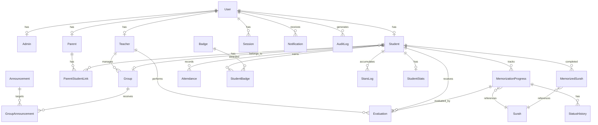
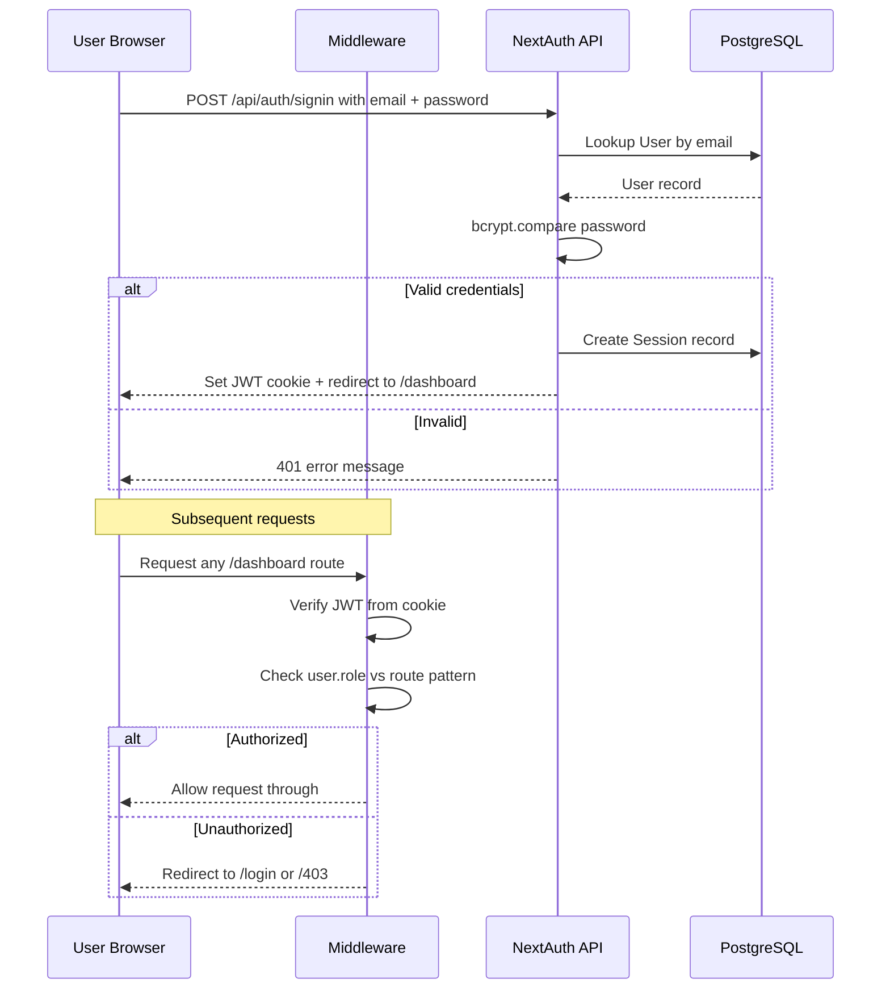
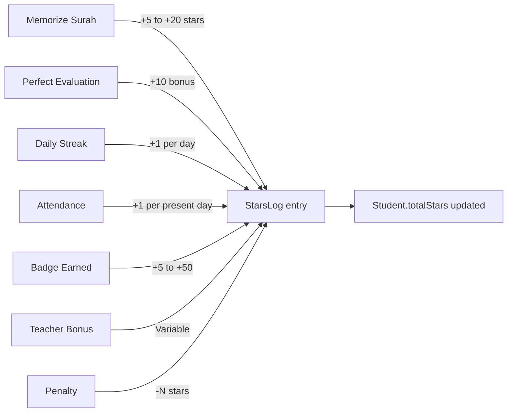

# AntiGravity (TAHFIDZ PRO) — Architecture Document

> **Plateforme de Mémorisation du Coran** — A comprehensive Quran memorization school management system.

---

## Table of Contents

1. [Project Overview & Goals](#1-project-overview--goals)
2. [Complete Tech Stack](#2-complete-tech-stack)
3. [Database Schema Documentation](#3-database-schema-documentation)
4. [Role-Based Access Control Matrix](#4-role-based-access-control-matrix)
5. [Folder Structure (Next.js App Router)](#5-folder-structure-nextjs-app-router)
6. [API Routes Plan](#6-api-routes-plan)
7. [Page / Route Structure per Role](#7-page--route-structure-per-role)
8. [Authentication Flow](#8-authentication-flow)
9. [i18n Strategy](#9-i18n-strategy)
10. [Gamification System Design](#10-gamification-system-design)

---

## 1. Project Overview & Goals

**AntiGravity** (code-named *TAHFIDZ PRO*) is a full-stack web application for managing Quran memorization schools (*Madrasas / Écoles coraniques*). It provides role-based dashboards for administrators, teachers, parents and students, with Arabic/French bilingual support.

### Core Objectives

| # | Goal | Description |
|---|------|-------------|
| 1 | **Student progress tracking** | Track memorization status per surah, verse range, and evaluation scores |
| 2 | **Multi-role dashboards** | Distinct experiences for Admin, Teacher, Parent, Student |
| 3 | **Evaluation & grading** | Teachers evaluate memorization quality, tajweed, fluency, makharij |
| 4 | **Gamification** | Stars, badges, streaks to motivate students |
| 5 | **Attendance management** | Daily check-in/out with status tracking |
| 6 | **Announcements & notifications** | Targeted announcements by role/group, real-time notifications |
| 7 | **Bilingual (AR/FR)** | Full RTL Arabic + LTR French support via `next-intl` |
| 8 | **Audit trail** | Complete audit logging of all sensitive actions |

---

## 2. Complete Tech Stack

### 2.1 Frontend

| Technology | Purpose |
|---|---|
| **Next.js 14** (App Router) | React meta-framework with server components, layouts, streaming |
| **TypeScript** (strict mode) | Type-safe development across the entire codebase |
| **Tailwind CSS** | Utility-first CSS framework |
| **shadcn/ui** | Base component library (built on Radix UI) |
| **Framer Motion** | Animations and page transitions |
| **React Hook Form + Zod** | Form management with runtime schema validation |
| **Recharts** | Dashboard charts and data visualization |
| **next-intl** | Internationalization — Arabic (AR) and French (FR) |

### 2.2 Backend

| Technology | Purpose |
|---|---|
| **Next.js API Routes** (Route Handlers) | REST API endpoints via `app/api/` |
| **Prisma ORM** | Type-safe database client and schema management |
| **PostgreSQL** (via Supabase or local) | Primary relational database |
| **NextAuth.js v5** | Authentication framework |
| **bcrypt** | Password hashing |
| **JWT** | Session tokens |

### 2.3 Services & Utilities

| Technology | Purpose |
|---|---|
| **Uploadthing** | File upload (avatars, attachments) |
| **Resend** | Transactional email delivery |
| **date-fns** | Date manipulation and formatting |

---

## 3. Database Schema Documentation

### 3.1 Enums

```prisma
enum UserRole {
  ADMIN
  TEACHER
  PARENT
  STUDENT
}

enum Gender {
  MALE
  FEMALE
}

enum MemorizationStatus {
  NOT_STARTED
  IN_PROGRESS
  UNDER_REVIEW
  READY_FOR_RECITATION
  PENDING_TEACHER_APPROVAL
  MEMORIZED
  NEEDS_REVISION
}

enum AttendanceStatus {
  PRESENT
  ABSENT
  LATE
  EXCUSED
}

enum AnnouncementType {
  GENERAL
  EVENT
  ACHIEVEMENT
  URGENT
}
```

### 3.2 Entity Relationship Diagram



### 3.3 Model Documentation

#### `User`

Core authentication and identity model. Every person in the system has one `User` record. Role-specific data is stored in polymorphic profile relations.

| Field | Type | Notes |
|---|---|---|
| `id` | `String` (UUID) | Primary key |
| `email` | `String` | Unique |
| `password` | `String` | Hashed with bcrypt |
| `fullName` | `String` | Display name (FR/EN) |
| `fullNameAr` | `String?` | Name in Arabic |
| `role` | `UserRole` | ADMIN, TEACHER, PARENT, STUDENT |
| `phone` | `String?` | |
| `gender` | `Gender?` | MALE, FEMALE |
| `avatar` | `String?` | URL to uploaded image |
| `isActive` | `Boolean` | Default `true` |
| `emailVerified` | `DateTime?` | |
| `createdAt` | `DateTime` | Auto |
| `updatedAt` | `DateTime` | Auto |
| `lastLoginAt` | `DateTime?` | |

**Relations:** `adminProfile`, `teacherProfile`, `parentProfile`, `studentProfile`, `notifications[]`, `sessions[]`, `auditLogs[]`

---

#### `Session`

Active login sessions for token-based auth.

| Field | Type | Notes |
|---|---|---|
| `id` | `String` (UUID) | Primary key |
| `userId` | `String` | FK → User |
| `token` | `String` | Unique JWT |
| `expiresAt` | `DateTime` | |
| `createdAt` | `DateTime` | Auto |

---

#### `Admin`

Extended profile for admin users.

| Field | Type | Notes |
|---|---|---|
| `id` | `String` (UUID) | Primary key |
| `userId` | `String` | Unique FK → User |
| `permissions` | `Json?` | Granular permission overrides |

---

#### `Teacher`

Extended profile for teachers.

| Field | Type | Notes |
|---|---|---|
| `id` | `String` (UUID) | Primary key |
| `userId` | `String` | Unique FK → User |
| `bio` | `String?` | |
| `specialization` | `String?` | |
| `maxStudents` | `Int` | Default 20 |
| `isActive` | `Boolean` | Default `true` |

**Relations:** `groups[]`, `evaluations[]`

---

#### `Parent`

Extended profile for parents.

| Field | Type | Notes |
|---|---|---|
| `id` | `String` (UUID) | Primary key |
| `userId` | `String` | Unique FK → User |

**Relations:** `childrenLinks[]` (via `ParentStudentLink`)

---

#### `Student`

Core student profile with progression tracking fields.

| Field | Type | Notes |
|---|---|---|
| `id` | `String` (UUID) | Primary key |
| `userId` | `String` | Unique FK → User |
| `studentCode` | `String` | Unique — used for parent access linking |
| `dateOfBirth` | `DateTime?` | |
| `enrollmentDate` | `DateTime` | Default `now()` |
| `groupId` | `String?` | FK → Group |
| `teacherId` | `String?` | FK → Teacher |
| `currentSurahId` | `Int?` | Currently active surah |
| `currentProgressId` | `String?` | |
| `totalStars` | `Int` | Default 0 |
| `currentStreak` | `Int` | Default 0 |
| `longestStreak` | `Int` | Default 0 |
| `lastActivityDate` | `DateTime?` | |
| `status` | `String` | `active`, `inactive`, `graduated` |

**Relations:** `group?`, `teacher?`, `parentLinks[]`, `memorizationProgress[]`, `memorizedSurahs[]`, `attendances[]`, `studentBadges[]`, `starsLogs[]`, `evaluations[]`, `stats?`

---

#### `ParentStudentLink`

Many-to-many join between Parent and Student with verification.

| Field | Type | Notes |
|---|---|---|
| `id` | `String` (UUID) | Primary key |
| `parentId` | `String` | FK → Parent |
| `studentId` | `String` | FK → Student |
| `relation` | `String` | `father`, `mother`, `guardian` |
| `accessCode` | `String` | Verification code |
| `isVerified` | `Boolean` | Default `false` |

**Unique constraint:** `(parentId, studentId)`

---

#### `Group`

Teaching groups / classes.

| Field | Type | Notes |
|---|---|---|
| `id` | `String` (UUID) | Primary key |
| `name` | `String` | |
| `nameAr` | `String?` | Arabic name |
| `teacherId` | `String` | FK → Teacher |
| `level` | `String` | `beginner`, `intermediate`, `advanced` |
| `schedule` | `Json?` | Weekly schedule object |
| `maxCapacity` | `Int` | Default 15 |
| `isActive` | `Boolean` | Default `true` |

**Relations:** `teacher`, `students[]`, `announcements[]`

---

#### `Surah`

Reference data — all 114 surahs of the Quran.

| Field | Type | Notes |
|---|---|---|
| `id` | `Int` | Primary key (1-114) |
| `nameAr` | `String` | Arabic name |
| `nameFr` | `String` | French name |
| `nameEn` | `String` | English name |
| `verseCount` | `Int` | |
| `juzNumber` | `Int` | Juz (part) number |
| `revelationType` | `String` | `meccan`, `medinan` |
| `difficultyLevel` | `Int` | 1-5, default 3 |
| `orderInMushaf` | `Int` | Print order |

---

#### `MemorizationProgress`

Tracks a student's progress on memorizing a specific surah or verse range.

| Field | Type | Notes |
|---|---|---|
| `id` | `String` (UUID) | Primary key |
| `studentId` | `String` | FK → Student |
| `surahId` | `Int` | FK → Surah |
| `startVerse` | `Int` | Default 1 |
| `endVerse` | `Int` | |
| `targetDate` | `DateTime?` | |
| `status` | `MemorizationStatus` | Default `NOT_STARTED` |
| `currentVerse` | `Int` | Default 1 |
| `completionPercentage` | `Float` | Default 0 |
| `startedAt` | `DateTime` | Auto |
| `completedAt` | `DateTime?` | |

**Unique constraint:** `(studentId, surahId, startVerse, endVerse)`

**Relations:** `evaluation?`, `statusHistory[]`

---

#### `StatusHistory`

Audit trail for memorization status transitions.

| Field | Type | Notes |
|---|---|---|
| `id` | `String` (UUID) | Primary key |
| `progressId` | `String` | FK → MemorizationProgress |
| `oldStatus` | `MemorizationStatus` | |
| `newStatus` | `MemorizationStatus` | |
| `changedBy` | `String` | userId of who changed it |
| `note` | `String?` | |

---

#### `MemorizedSurah`

Snapshot of a fully completed surah memorization.

| Field | Type | Notes |
|---|---|---|
| `id` | `String` (UUID) | Primary key |
| `studentId` | `String` | FK → Student |
| `surahId` | `Int` | FK → Surah |
| `progressId` | `String` | Unique FK → MemorizationProgress |
| `completionDate` | `DateTime` | Auto |
| `versesMemorized` | `Int` | For partial verse ranges |
| `finalScore` | `Int?` | |
| `teacherNotes` | `String?` | |
| `starsEarned` | `Int` | Default 0 |

---

#### `Evaluation`

Teacher evaluation of a student's recitation.

| Field | Type | Notes |
|---|---|---|
| `id` | `String` (UUID) | Primary key |
| `progressId` | `String` | Unique FK → MemorizationProgress |
| `studentId` | `String` | FK → Student |
| `teacherId` | `String` | FK → Teacher |
| `evaluatedAt` | `DateTime` | Auto |
| `evaluationType` | `String` | `live`, `recorded`, `test` |
| `memorizationScore` | `Int` | 0-100 — memorization quality |
| `tajweedScore` | `Int` | 0-100 — tajweed rules |
| `fluencyScore` | `Int` | 0-100 — fluency |
| `makharijScore` | `Int?` | 0-100 — articulation points |
| `tafsirUnderstanding` | `Int?` | 0-100 — comprehension (optional) |
| `finalScore` | `Int` | Calculated composite score |
| `teacherNotes` | `String?` | Text (long) |
| `strengths` | `String[]` | Array of strength points |
| `improvements` | `String[]` | Array of improvement areas |
| `revisionRequired` | `Boolean` | Default `false` |
| `decision` | `String` | `approved`, `needs_revision`, `rejected` |

---

#### `Attendance`

Daily attendance records per student.

| Field | Type | Notes |
|---|---|---|
| `id` | `String` (UUID) | Primary key |
| `studentId` | `String` | FK → Student |
| `groupId` | `String?` | |
| `date` | `DateTime` | |
| `status` | `AttendanceStatus` | PRESENT, ABSENT, LATE, EXCUSED |
| `checkInTime` | `DateTime?` | |
| `checkOutTime` | `DateTime?` | |
| `notes` | `String?` | |
| `recordedBy` | `String` | userId |

**Unique constraint:** `(studentId, date)`

---

#### `Badge`

Definition of earnable badges.

| Field | Type | Notes |
|---|---|---|
| `id` | `String` (UUID) | Primary key |
| `name` | `String` | |
| `nameAr` | `String` | Arabic name |
| `description` | `String` | |
| `descriptionAr` | `String` | Arabic description |
| `icon` | `String` | Emoji or URL |
| `color` | `String` | Badge color |
| `criteriaType` | `String` | `surah_count`, `streak_days`, `total_stars`, `perfect_score`, `juz_complete`, `attendance` |
| `criteriaValue` | `Int` | Threshold value |
| `rarity` | `String` | `common`, `rare`, `epic`, `legendary` |

---

#### `StudentBadge`

Join table: which students earned which badges.

| Field | Type | Notes |
|---|---|---|
| `id` | `String` (UUID) | Primary key |
| `studentId` | `String` | FK → Student |
| `badgeId` | `String` | FK → Badge |
| `earnedAt` | `DateTime` | Auto |
| `earnedValue` | `Int` | Value at time of earning |

**Unique constraint:** `(studentId, badgeId)`

---

#### `StarsLog`

Ledger of star transactions (credits and debits).

| Field | Type | Notes |
|---|---|---|
| `id` | `String` (UUID) | Primary key |
| `studentId` | `String` | FK → Student |
| `amount` | `Int` | Positive or negative |
| `balanceAfter` | `Int` | Running balance |
| `sourceType` | `String` | `memorization`, `attendance`, `streak`, `achievement`, `bonus`, `penalty` |
| `sourceId` | `String?` | Reference ID |
| `reason` | `String` | Human-readable reason |
| `awardedBy` | `String?` | userId or null if automatic |

---

#### `Announcement`

School-wide or targeted announcements.

| Field | Type | Notes |
|---|---|---|
| `id` | `String` (UUID) | Primary key |
| `title` | `String` | |
| `titleAr` | `String?` | Arabic title |
| `content` | `String` | Text (long) |
| `contentAr` | `String?` | Arabic content (long) |
| `type` | `AnnouncementType` | GENERAL, EVENT, ACHIEVEMENT, URGENT |
| `targetRoles` | `UserRole[]` | Which roles see it |
| `isPinned` | `Boolean` | Default `false` |
| `isPublished` | `Boolean` | Default `true` |
| `publishedAt` | `DateTime` | Auto |
| `expiresAt` | `DateTime?` | |
| `createdBy` | `String` | FK → User |

**Relations:** `targetGroups[]` (via `GroupAnnouncement`)

---

#### `GroupAnnouncement`

Join table for targeting announcements to specific groups.

| Field | Type | Notes |
|---|---|---|
| `announcementId` | `String` | FK → Announcement |
| `groupId` | `String` | FK → Group |

**Unique constraint:** `(announcementId, groupId)`

---

#### `Notification`

Per-user notifications.

| Field | Type | Notes |
|---|---|---|
| `id` | `String` (UUID) | Primary key |
| `userId` | `String` | FK → User |
| `type` | `String` | `progress_update`, `evaluation`, `announcement`, `reminder`, `achievement` |
| `title` | `String` | |
| `titleAr` | `String?` | |
| `message` | `String` | |
| `messageAr` | `String?` | |
| `data` | `Json?` | Flexible metadata (IDs, URLs, actions) |
| `isRead` | `Boolean` | Default `false` |
| `readAt` | `DateTime?` | |

---

#### `StudentStats`

Denormalized / pre-calculated student statistics.

| Field | Type | Notes |
|---|---|---|
| `id` | `String` (UUID) | Primary key |
| `studentId` | `String` | Unique FK → Student |
| `totalSurahsMemorized` | `Int` | Default 0 |
| `totalVersesMemorized` | `Int` | Default 0 |
| `totalEvaluationScore` | `Int` | Default 0 |
| `evaluationCount` | `Int` | Default 0 |
| `averageScore` | `Float` | Default 0 |
| `attendanceRate` | `Float` | Default 0 |
| `currentStreakStart` | `DateTime?` | |
| `longestStreakStart` | `DateTime?` | |
| `longestStreakEnd` | `DateTime?` | |
| `lastCalculatedAt` | `DateTime` | Auto |

---

#### `AuditLog`

System-wide audit trail.

| Field | Type | Notes |
|---|---|---|
| `id` | `String` (UUID) | Primary key |
| `userId` | `String` | FK → User |
| `action` | `String` | `create`, `update`, `delete`, `login`, `logout`, etc. |
| `entityType` | `String` | `student`, `evaluation`, etc. |
| `entityId` | `String?` | |
| `oldValues` | `Json?` | Previous state |
| `newValues` | `Json?` | New state |
| `ipAddress` | `String?` | |
| `userAgent` | `String?` | |

### 3.4 Performance Indexes

```prisma
@@index([studentId, status], name: "idx_progress_student_status")
@@index([teacherId], name: "idx_teacher_evaluations")
@@index([date], name: "idx_attendance_date")
@@index([userId, isRead], name: "idx_notifications_user_read")
```

---

## 4. Role-Based Access Control Matrix

### 4.1 Roles

| Role | Code | Description |
|---|---|---|
| Admin | `ADMIN` | Full system management |
| Teacher | `TEACHER` | Manages groups, evaluates students |
| Parent | `PARENT` | Read-only access to own children's data |
| Student | `STUDENT` | Views own progress, marks readiness |

### 4.2 Permission Matrix

| Feature | Admin | Teacher | Parent | Student |
|---|---|---|---|---|
| User management | ✅ | ❌ | ❌ | ❌ |
| Assign teachers | ✅ | ❌ | ❌ | ❌ |
| View all students | ✅ | ✅ (own groups) | ❌ (own children) | ❌ (self only) |
| Evaluate memorization | ❌ | ✅ | ❌ | ❌ |
| Modify progression | ❌ | ✅ | ❌ | ✅ (own profile) |
| View grades/comments | ✅ | ✅ | ✅ (own children) | ✅ |
| Mark "ready to recite" | ❌ | ❌ | ❌ | ✅ |
| Manage attendance | ❌ | ✅ | ❌ | ❌ |
| Create announcements | ✅ | ✅ | ❌ | ❌ |
| View dashboard | ✅ | ✅ | ✅ | ✅ |

---

## 5. Folder Structure (Next.js App Router)

```
antigravity/
├── prisma/
│   ├── schema.prisma
│   ├── seed.ts                    # Seed surahs + default admin
│   └── migrations/
├── public/
│   ├── locales/
│   │   ├── ar.json
│   │   └── fr.json
│   └── images/
├── src/
│   ├── app/
│   │   ├── [locale]/              # next-intl dynamic locale
│   │   │   ├── layout.tsx         # RTL/LTR wrapper, font loading
│   │   │   ├── page.tsx           # Landing / redirect to dashboard
│   │   │   ├── (auth)/
│   │   │   │   ├── login/page.tsx
│   │   │   │   ├── register/page.tsx
│   │   │   │   └── forgot-password/page.tsx
│   │   │   ├── (dashboard)/
│   │   │   │   ├── layout.tsx     # Sidebar + topbar shell
│   │   │   │   ├── admin/
│   │   │   │   │   ├── page.tsx               # Admin dashboard
│   │   │   │   │   ├── users/page.tsx         # User CRUD
│   │   │   │   │   ├── groups/page.tsx        # Group management
│   │   │   │   │   ├── announcements/page.tsx
│   │   │   │   │   ├── reports/page.tsx
│   │   │   │   │   └── audit-log/page.tsx
│   │   │   │   ├── teacher/
│   │   │   │   │   ├── page.tsx               # Teacher dashboard
│   │   │   │   │   ├── groups/[id]/page.tsx   # Group detail
│   │   │   │   │   ├── students/[id]/page.tsx # Student detail
│   │   │   │   │   ├── evaluate/page.tsx      # Evaluation form
│   │   │   │   │   ├── attendance/page.tsx
│   │   │   │   │   └── announcements/page.tsx
│   │   │   │   ├── parent/
│   │   │   │   │   ├── page.tsx               # Parent dashboard
│   │   │   │   │   ├── children/page.tsx
│   │   │   │   │   ├── children/[id]/page.tsx # Child progress
│   │   │   │   │   └── link-child/page.tsx    # Link via student code
│   │   │   │   ├── student/
│   │   │   │   │   ├── page.tsx               # Student dashboard
│   │   │   │   │   ├── progress/page.tsx      # Memorization progress
│   │   │   │   │   ├── quran/page.tsx         # Surah browser
│   │   │   │   │   ├── badges/page.tsx        # Badge collection
│   │   │   │   │   └── profile/page.tsx
│   │   │   │   ├── notifications/page.tsx     # Shared
│   │   │   │   └── settings/page.tsx          # Shared
│   │   ├── api/
│   │   │   ├── auth/[...nextauth]/route.ts
│   │   │   ├── users/route.ts
│   │   │   ├── users/[id]/route.ts
│   │   │   ├── students/route.ts
│   │   │   ├── students/[id]/route.ts
│   │   │   ├── students/[id]/progress/route.ts
│   │   │   ├── students/[id]/badges/route.ts
│   │   │   ├── students/[id]/stars/route.ts
│   │   │   ├── students/[id]/attendance/route.ts
│   │   │   ├── teachers/route.ts
│   │   │   ├── teachers/[id]/route.ts
│   │   │   ├── parents/route.ts
│   │   │   ├── parents/[id]/children/route.ts
│   │   │   ├── parents/link/route.ts
│   │   │   ├── groups/route.ts
│   │   │   ├── groups/[id]/route.ts
│   │   │   ├── groups/[id]/students/route.ts
│   │   │   ├── evaluations/route.ts
│   │   │   ├── evaluations/[id]/route.ts
│   │   │   ├── attendance/route.ts
│   │   │   ├── attendance/bulk/route.ts
│   │   │   ├── announcements/route.ts
│   │   │   ├── announcements/[id]/route.ts
│   │   │   ├── notifications/route.ts
│   │   │   ├── notifications/mark-read/route.ts
│   │   │   ├── surahs/route.ts
│   │   │   ├── badges/route.ts
│   │   │   ├── stats/dashboard/route.ts
│   │   │   ├── audit-log/route.ts
│   │   │   └── uploadthing/route.ts
│   ├── components/
│   │   ├── ui/                    # shadcn/ui primitives
│   │   ├── layout/
│   │   │   ├── Sidebar.tsx
│   │   │   ├── Topbar.tsx
│   │   │   ├── MobileSidebar.tsx
│   │   │   └── LocaleSwitcher.tsx
│   │   ├── dashboard/
│   │   │   ├── AdminDashboard.tsx
│   │   │   ├── TeacherDashboard.tsx
│   │   │   ├── ParentDashboard.tsx
│   │   │   └── StudentDashboard.tsx
│   │   ├── memorization/
│   │   │   ├── ProgressCard.tsx
│   │   │   ├── SurahSelector.tsx
│   │   │   ├── StatusBadge.tsx
│   │   │   └── ProgressTimeline.tsx
│   │   ├── evaluation/
│   │   │   ├── EvaluationForm.tsx
│   │   │   └── ScoreRadar.tsx
│   │   ├── gamification/
│   │   │   ├── BadgeDisplay.tsx
│   │   │   ├── StarsCounter.tsx
│   │   │   ├── StreakIndicator.tsx
│   │   │   └── Leaderboard.tsx
│   │   ├── attendance/
│   │   │   ├── AttendanceGrid.tsx
│   │   │   └── AttendanceCalendar.tsx
│   │   └── shared/
│   │       ├── DataTable.tsx
│   │       ├── ConfirmDialog.tsx
│   │       ├── LoadingSpinner.tsx
│   │       └── EmptyState.tsx
│   ├── lib/
│   │   ├── prisma.ts              # Singleton Prisma client
│   │   ├── auth.ts                # NextAuth config
│   │   ├── auth-options.ts
│   │   ├── validations/           # Zod schemas
│   │   │   ├── user.ts
│   │   │   ├── student.ts
│   │   │   ├── evaluation.ts
│   │   │   ├── attendance.ts
│   │   │   └── announcement.ts
│   │   ├── utils.ts               # cn(), formatDate(), etc.
│   │   ├── constants.ts           # Surah data, role maps
│   │   ├── permissions.ts         # RBAC helper functions
│   │   └── gamification.ts        # Badge/star calculation logic
│   ├── hooks/
│   │   ├── useCurrentUser.ts
│   │   ├── usePermissions.ts
│   │   ├── useNotifications.ts
│   │   └── useProgress.ts
│   ├── types/
│   │   ├── index.ts
│   │   ├── api.ts
│   │   └── prisma.ts              # Extended Prisma types
│   ├── middleware.ts              # Auth + locale + role guards
│   └── i18n.ts                    # next-intl configuration
├── .env.example
├── next.config.js
├── tailwind.config.ts
├── tsconfig.json
└── package.json
```

---

## 6. API Routes Plan

### 6.1 Authentication

| Method | Route | Access | Description |
|---|---|---|---|
| POST | `/api/auth/[...nextauth]` | Public | NextAuth handler (login, callback, session) |
| POST | `/api/auth/register` | Public | User registration |
| POST | `/api/auth/forgot-password` | Public | Password reset request |

### 6.2 Users

| Method | Route | Access | Description |
|---|---|---|---|
| GET | `/api/users` | Admin | List all users (paginated, filterable) |
| POST | `/api/users` | Admin | Create new user |
| GET | `/api/users/[id]` | Admin, Self | Get user detail |
| PATCH | `/api/users/[id]` | Admin, Self | Update user |
| DELETE | `/api/users/[id]` | Admin | Deactivate user |

### 6.3 Students

| Method | Route | Access | Description |
|---|---|---|---|
| GET | `/api/students` | Admin, Teacher (own groups) | List students |
| POST | `/api/students` | Admin | Create student |
| GET | `/api/students/[id]` | Admin, Teacher, Parent (own child), Self | Student detail |
| PATCH | `/api/students/[id]` | Admin, Teacher | Update student |
| GET | `/api/students/[id]/progress` | Admin, Teacher, Parent (own), Self | Memorization progress |
| POST | `/api/students/[id]/progress` | Teacher, Self | Create/update progress entry |
| GET | `/api/students/[id]/badges` | All (scoped) | Student badges |
| GET | `/api/students/[id]/stars` | All (scoped) | Stars log |
| GET | `/api/students/[id]/attendance` | All (scoped) | Attendance history |

### 6.4 Groups

| Method | Route | Access | Description |
|---|---|---|---|
| GET | `/api/groups` | Admin, Teacher | List groups |
| POST | `/api/groups` | Admin | Create group |
| GET | `/api/groups/[id]` | Admin, Teacher (own) | Group detail |
| PATCH | `/api/groups/[id]` | Admin | Update group |
| GET | `/api/groups/[id]/students` | Admin, Teacher (own) | Students in group |
| POST | `/api/groups/[id]/students` | Admin | Assign student to group |

### 6.5 Evaluations

| Method | Route | Access | Description |
|---|---|---|---|
| GET | `/api/evaluations` | Admin, Teacher | List evaluations |
| POST | `/api/evaluations` | Teacher | Create evaluation |
| GET | `/api/evaluations/[id]` | Admin, Teacher, Parent (own child), Self | Evaluation detail |

### 6.6 Attendance

| Method | Route | Access | Description |
|---|---|---|---|
| GET | `/api/attendance` | Admin, Teacher | List attendance records |
| POST | `/api/attendance` | Teacher | Record single attendance |
| POST | `/api/attendance/bulk` | Teacher | Bulk attendance for a group |

### 6.7 Announcements

| Method | Route | Access | Description |
|---|---|---|---|
| GET | `/api/announcements` | All (filtered by role) | List announcements |
| POST | `/api/announcements` | Admin, Teacher | Create announcement |
| GET | `/api/announcements/[id]` | All (scoped) | Announcement detail |
| PATCH | `/api/announcements/[id]` | Admin, Author | Update announcement |
| DELETE | `/api/announcements/[id]` | Admin, Author | Delete announcement |

### 6.8 Notifications

| Method | Route | Access | Description |
|---|---|---|---|
| GET | `/api/notifications` | Self | List own notifications |
| POST | `/api/notifications/mark-read` | Self | Mark notification(s) as read |

### 6.9 Reference Data & Utilities

| Method | Route | Access | Description |
|---|---|---|---|
| GET | `/api/surahs` | All | List all 114 surahs |
| GET | `/api/badges` | All | List badge definitions |
| GET | `/api/stats/dashboard` | All (scoped by role) | Dashboard statistics |
| GET | `/api/audit-log` | Admin | Audit log entries |
| POST | `/api/uploadthing` | Authenticated | File upload endpoint |

### 6.10 Parent Link

| Method | Route | Access | Description |
|---|---|---|---|
| POST | `/api/parents/link` | Parent | Link child via student code |
| GET | `/api/parents/[id]/children` | Parent (self), Admin | List linked children |

---

## 7. Page / Route Structure per Role

### 7.1 Admin Pages

```
/[locale]/admin
├── /                    → Dashboard: total students, teachers, groups, global stats charts
├── /users               → DataTable of all users; create/edit/deactivate
├── /groups              → Group management; assign teachers, set capacity
├── /announcements       → Create/manage school-wide announcements
├── /reports             → Exportable reports (progress, attendance, evaluations)
└── /audit-log           → Searchable audit log viewer
```

### 7.2 Teacher Pages

```
/[locale]/teacher
├── /                    → Dashboard: my groups overview, pending evaluations, today's attendance
├── /groups/[id]         → Group detail: student list, avg progress, schedule
├── /students/[id]       → Student detail: progress timeline, evaluations, stars
├── /evaluate            → Evaluation form (select student → score → submit)
├── /attendance          → Bulk attendance entry per group per day
└── /announcements       → Group-level announcements
```

### 7.3 Parent Pages

```
/[locale]/parent
├── /                    → Dashboard: children summary cards, recent activity
├── /children            → List of linked children
├── /children/[id]       → Child detail: memorization heatmap, evaluations, badges
└── /link-child          → Enter student code to link new child
```

### 7.4 Student Pages

```
/[locale]/student
├── /                    → Dashboard: current surah progress, streak, stars, next goals
├── /progress            → Full memorization log, status per surah
├── /quran               → Surah browser — select a surah, mark "ready to recite"
├── /badges              → Badge collection with earned/locked state
└── /profile             → Personal settings, avatar upload
```

---

## 8. Authentication Flow



### Key Implementation Details

- **NextAuth.js v5** with Credentials provider (email + password)
- **bcrypt** hashing with salt rounds of 12
- **JWT strategy** — tokens stored as HTTP-only secure cookies
- **Middleware** (`src/middleware.ts`) enforces:
  - Locale prefix routing (`/ar/...` or `/fr/...`)
  - Authentication check on all `/dashboard/**` routes
  - Role-based route guards: `/admin/**` requires `ADMIN`, `/teacher/**` requires `TEACHER`, etc.
- **Session model** in DB allows server-side session invalidation
- **AuditLog** entry created on every login/logout

---

## 9. i18n Strategy

### 9.1 Configuration

- **Library:** `next-intl` with App Router integration
- **Default locale:** `fr` (French)
- **Supported locales:** `fr`, `ar`
- **URL structure:** `/fr/dashboard`, `/ar/dashboard`

### 9.2 RTL Support

- Arabic (`ar`) routes render with `dir="rtl"` on the `<html>` element
- Tailwind CSS logical properties (`ms-`, `me-`, `ps-`, `pe-`) used instead of `ml-`/`mr-`
- Sidebar flips to right side in RTL mode
- Font loading: Arabic font (e.g., Amiri, Noto Naskh Arabic) for `ar`, system sans-serif for `fr`

### 9.3 Translation Strategy

| Content Type | Strategy |
|---|---|
| UI labels, buttons, headings | `next-intl` message files (`ar.json`, `fr.json`) |
| Database fields (names, descriptions) | Dual columns (`name` / `nameAr`, `title` / `titleAr`) |
| Surah names | Stored in DB as `nameAr`, `nameFr`, `nameEn` |
| User-generated content | Stored as-is; no automatic translation |
| Validation error messages | Zod `.message()` with translated strings |

### 9.4 Locale Switching

- `LocaleSwitcher` component in the topbar
- Preserves current route path when switching locales
- User locale preference stored in cookie/localStorage

---

## 10. Gamification System Design

### 10.1 Stars Economy

Stars are the primary reward currency. They are earned and (rarely) spent or deducted.



**Star Amounts by Source:**

| Source | Event | Stars |
|---|---|---|
| Memorization | Surah completed | +5 to +20 (based on difficulty) |
| Evaluation | Score ≥ 90 | +10 bonus |
| Attendance | Present | +1 |
| Streak | Each consecutive day | +1 |
| Achievement | Badge unlocked | +5 to +50 (by rarity) |
| Bonus | Teacher manual award | Variable |
| Penalty | Teacher/Admin deduction | -N |

### 10.2 Badge System

Badges are unlocked when a student meets specific criteria. Each badge has a rarity tier.

| Criteria Type | Examples |
|---|---|
| `surah_count` | Memorized 5 surahs → "Rising Star"; 30 surahs → "Hafiz in Training" |
| `streak_days` | 7-day streak → "Consistent"; 30-day → "Unstoppable" |
| `total_stars` | 100 stars → "Star Collector"; 1000 → "Star Master" |
| `perfect_score` | 5 perfect evaluations → "Perfectionist" |
| `juz_complete` | Completed Juz 30 → "Amma Champion" |
| `attendance` | 30 consecutive present → "Always There" |

**Rarity Tiers:**

| Rarity | Color | Star Bonus | Probability |
|---|---|---|---|
| Common | 🟢 Green | +5 | Easy to achieve |
| Rare | 🔵 Blue | +15 | Moderate effort |
| Epic | 🟣 Purple | +30 | Significant milestone |
| Legendary | 🟡 Gold | +50 | Exceptional achievement |

### 10.3 Streak System

- **Current streak** increments by 1 for each consecutive day with any memorization activity
- **Streak resets** to 0 if a day is missed (no activity + no excused absence)
- **Longest streak** is recorded for all-time display
- **Streak milestones** (7, 14, 30, 60, 90 days) trigger badge checks and bonus stars

### 10.4 Leaderboard

- Group-level leaderboard showing top students by total stars
- Weekly/monthly/all-time views
- Opt-out option for privacy (configurable per student)

---

*Document generated from the AntiGravity markmap specification. Last updated: 2026-03-07.*
